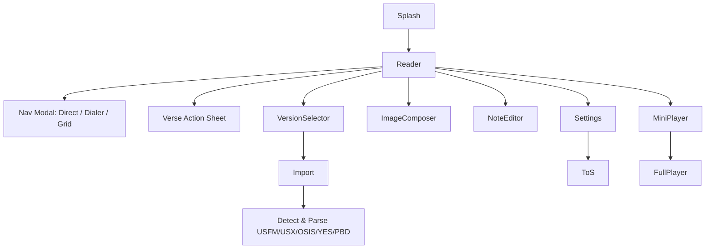

# Another Bible

An offline-first Flutter Bible app built with Clean Architecture principles and modern best practices.

## Project Goal
Offline-first Flutter Bible app where the reader is the home screen. Bundles **TSI + KJV** translations and allows users to import their own Bible files (USFM, USX, OSIS, YES v1/v2, PBD). No backend required in Phase 1.

## 🚀 Features

### Non-Negotiables
- **100% Offline Operation** - No internet connection required
- **Reader-First UI** - Bible reader as main screen, no hamburger menu
- **Legal Compliance** - Shows disclaimer, never bundles proprietary texts
- **Gesture Navigation** - Edge-swipe and pull-down modal navigation

### Architecture & State Management
- **Clean Architecture** with clear separation of concerns
- **BLoC Pattern** for state management
- **Dependency Injection** with Injectable & GetIt
- **Repository Pattern** for data layer abstraction

### Core Features
- 📖 **Bible Reader** - Primary interface with auto-hiding top bar
- 🔄 **Chapter Navigation** - Swipe left/right between chapters
- � **Verse Pill FAB** - Floating action button for quick jump to nav/search/version
- � **Bible Import** - Support for USFM, USX, OSIS, YES v1/v2, PBD formats
- 🗂️ **Navigation Modal** - Direct / Dialer / Grid navigation modes
- 📝 **Note Editor** - Personal study notes
- � **Audio Player** - Optional audio Bible support with mini/full player
- �️ **Image Composer** - Verse sharing capabilities
- ⚙️ **Settings** - App configuration and preferences
- 🌍 **Internationalization** - Support for multiple languages (EN/ID)
- 🎨 **Material 3 Theming** - Light/Dark mode support

### Technical Stack
- **Flutter 3.32.6** (Latest stable) with Material 3
- **Dart 3.x** with null safety
- **BLoC 9.1.1** for state management
- **GoRouter 16.0.0** for navigation
- **Injectable 2.5.0** for dependency injection
- **SQLite** for local database (preferred) or Hive alternative
- **just_audio** for audio Bible support (optional)
- **flutter_local_notifications** for notifications

### Platform Support
- ✅ **Android** (API 21+) with multidex support
- ✅ **iOS** (iOS 12+)
- ✅ **Web** with modern initialization
- ✅ **macOS**
- ✅ **Linux**
- ✅ **Windows**

## 📁 Project Structure

```
lib/
├── core/                           # Core functionality
│   ├── constants/                  # App constants
│   ├── di/                        # Dependency injection
│   ├── error/                     # Error handling
│   ├── network/                   # HTTP client setup
│   ├── theme/                     # App theming
│   └── utils/                     # Utilities
├── features/                      # Feature modules
│   ├── bible/                     # Bible reader & navigation
│   │   ├── data/                  # Data layer (SQLite, import parsers)
│   │   ├── domain/                # Domain layer (entities, repositories)
│   │   └── presentation/          # Presentation layer (reader, modals)
│   ├── audio/                     # Audio player feature
│   ├── notes/                     # Note-taking feature
│   ├── settings/                  # App settings
│   └── debug/                     # Debug utilities
└── l10n/                         # Localization files
```

## 🔄 App Flow



## 🛠 Getting Started

### Prerequisites
- Flutter 3.32.6 or higher
- Dart 3.x or higher
- Android Studio / VS Code
- Git

### Installation

1. **Clone the repository**
   ```bash
   git clone <your-repo-url>
   cd another_bible
   ```

2. **Install dependencies**
   ```bash
   flutter pub get
   ```

3. **Generate code**
   ```bash
   flutter packages pub run build_runner build
   ```

4. **Run the app**
   ```bash
   # Web
   flutter run -d chrome

   # Android
   flutter run -d android

   # iOS
   flutter run -d ios
   ```

## 🎮 Key UX Features

### Navigation
- **Auto-hiding top bar** - Clean reading experience
- **Edge-swipe navigation** - Pull-down nav modal with three modes:
  - **Direct**: Quick book/chapter selection
  - **Dialer**: Number-based navigation
  - **Grid**: Visual book grid
- **Chapter swiping** - Left/right swipe between chapters
- **Verse Pill FAB** - Floating button for jump to navigation/search/version

### Reading Experience
- **Reader-first design** - Bible text is the primary interface
- **Gesture-based controls** - Minimal UI, maximum content
- **Verse actions** - Long-press for notes, sharing, highlighting
- **Audio integration** - Optional audio Bible with mini/full player modes

## 📋 Usage

### Bible Import
The app supports importing Bible files in multiple formats:
- **USFM** (Unified Standard Format Markers)
- **USX** (Unified Scripture XML)
- **OSIS** (Open Scripture Information Standard)
- **YES v1/v2** (Youth Explorer Series)
- **PBD** (Personal Bible Database)

The import pipeline automatically detects and parses these formats into the local SQLite database.

### Adding New Features

1. **Create feature directory structure:**
   ```
   lib/features/your_feature/
   ├── data/
   │   ├── datasources/
   │   ├── models/
   │   └── repositories/
   ├── domain/
   │   ├── entities/
   │   ├── repositories/
   │   └── usecases/
   └── presentation/
       ├── bloc/
       ├── pages/
       └── widgets/
   ```

2. **Register dependencies in `service_locator.dart`**

3. **Add routes in `app_router.dart`**

4. **Add localization strings in `l10n/`**

### Customization

#### Package Name
The app uses `xyz.marchell.another_bible`. To change:

1. Update `pubspec.yaml`
2. Update Android `build.gradle` files
3. Update iOS configuration files
4. Rename Kotlin package directories

#### Theme
Modify `lib/core/theme/app_theme.dart` for custom colors and styling.

#### Localization
Add new language files in `lib/l10n/` following the `app_en.arb` format.

#### Legal Compliance
- Always show disclaimer for bundled translations
- Never bundle proprietary Bible texts without permission
- Provide clear attribution for included translations (TSI, KJV)

## 🧪 Testing

Run tests with:
```bash
# All tests
flutter test

# Specific test file
flutter test test/path/to/test_file.dart

# With coverage
flutter test --coverage
```

## 📱 Build & Deployment

### Android
```bash
# Debug APK
flutter build apk --debug

# Release APK
flutter build apk --release

# App Bundle
flutter build appbundle --release
```

### iOS
```bash
# Debug
flutter build ios --debug

# Release
flutter build ios --release
```

### Web
```bash
flutter build web --release
```

## 🔧 Configuration

### Environment Setup
The project uses `mise.toml` for Flutter version management. Make sure to have:
- Flutter 3.32.6
- Proper Android SDK setup
- Xcode (for iOS/macOS development)

### Database Setup
The app uses SQLite for local storage of Bible texts, notes, and user preferences. No external database setup required - everything runs offline.

### Audio Setup (Optional)
For audio Bible functionality:
1. Add audio files to appropriate directories
2. Configure `just_audio` settings in audio feature module
3. Set up local notifications for playback controls

## 📚 Learning Resources

- [Clean Architecture](https://blog.cleancoder.com/uncle-bob/2012/08/13/the-clean-architecture.html)
- [BLoC Pattern](https://bloclibrary.dev/)
- [Flutter Documentation](https://docs.flutter.dev/)
- [Dart Documentation](https://dart.dev/guides)
- [Bible File Formats](https://ubsicap.github.io/usfm/) - USFM specification
- [OSIS Documentation](http://www.bibletechnologies.net/) - Open Scripture Information Standard

## 🤝 Contributing

1. Fork the repository
2. Create your feature branch (`git checkout -b feature/amazing-feature`)
3. Commit your changes (`git commit -m 'Add some amazing feature'`)
4. Push to the branch (`git push origin feature/amazing-feature`)
5. Open a Pull Request

## 📄 License

This project is licensed under the MIT License - see the [LICENSE](LICENSE) file for details.

## 🙏 Acknowledgments

- Flutter team for the amazing framework
- BLoC library maintainers
- Clean Architecture principles by Robert C. Martin
- Bible translation organizations (TSI, KJV contributors)
- Open source community for various packages used

---

**Happy Reading! �✨**
